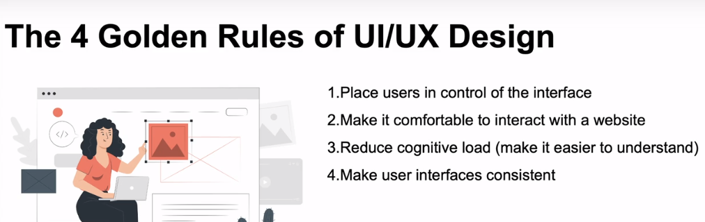

# Web Design

## The Three

# The Course

# CSS Animations

The animation-timing-function property specifies the speed curve of the animation.

The animation-timing-function property can have the following values:

- ease - Specifies an animation with a slow start, then fast, then end slowly (this is default)
- linear - Specifies an animation with the same speed from start to end
- ease-in - Specifies an animation with a slow start
- ease-out - Specifies an animation with a slow end
- ease-in-out - Specifies an animation with a slow start and end
- cubic-bezier(n,n,n,n) - Lets you define your own values in a cubic-bezier function

# Golden Rules of UI/UX Design

# The New Responsive

https://web.dev/new-responsive/